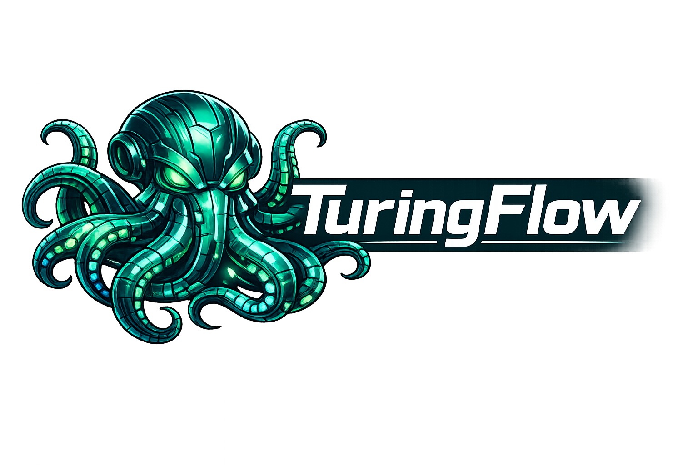

# TuringFlow



[](https://github.com/nschaetti/TuringFlow/actions/workflows/rust.yml)
[](https://codecov.io/gh/nschaetti/TuringFlow)

TuringFlow is a Rust foundation for **secure agent orchestration** with:

- a transport plane (`TFPv1`) for agent-to-agent communication,
- a kernel-like syscall/policy layer for controlled host access,
- a user communication plane for channels like Matrix/email/webhook,
- SQLite-backed durability (registry, dedupe, acks, audit, user queues).

## Architectural overview

TuringFlow separates concerns into two explicit planes.

1. **Inter-agent plane (`TFPv1`)**
   - registration and heartbeat leases,
   - route resolution,
   - message forward + retry,
   - replay-window checks and deduplication,
   - ACK persistence.

2. **User plane (`user.*` kernel syscalls)**
   - `user.ingest`: user -> agent queue,
   - `user.recv`: agent consumes user messages,
   - `user.send`: agent -> user queue,
   - `user.inbox`: inspect outbound queue,
   - `user.route.resolve`: channel selection policy.

Channel connectors (currently Matrix worker) map external events to this user
plane and do **not** impersonate TFPv1 peers.

## Repository structure

- `src/lib.rs`: crate-level architecture and module exports
- `src/bin/turingflowd.rs`: mTLS daemon, TFPv1 API, background workers
- `src/main.rs`: `turingflow` CLI entrypoint
- `src/kernel/*`: policy engine, syscall dispatch, audit sinks
- `src/tfpv1/*`: protocol types, router, storage backends
- `src/user_channels/*`: channel config + Matrix worker
- `src/commands/*`: CLI command handlers
- `config/*.yaml`: runtime configuration
- `docs/`: user/dev/ops documentation

## Agent model and invariants

- Principals are evaluated with precedence: `agent_tool:*` then `agent:*`.
- Policy is deny-by-default.
- Message ids are used for idempotency/dedupe.
- Leases expire automatically if heartbeats stop.
- All kernel decisions are auditable (`syscall_audit_log`).
- Provider traits are `Send + Sync` for safe concurrent access.

## Quick start

### Prerequisites

- Rust stable toolchain
- SQLite (bundled through `rusqlite`)
- Certificates configured for daemon mTLS

### Build

```bash
cargo build
```

### CLI help

```bash
cargo run --bin turingflow -- --help
```

### Daemon help

```bash
cargo run --bin turingflowd -- --help
```

### Start daemon

```bash
cargo run --bin turingflowd -- \
  --config config/turingflowd.yaml \
  --kingdoms-config config/kingdoms.yaml \
  --channels-config config/channels.yaml
```

## Useful commands

- Queue user message:

```bash
cargo run --bin turingflow -- chat --message "Hello" --channel cli --thread-id user-main
```

- Show outbound user inbox:

```bash
cargo run --bin turingflow -- inbox --limit 20
```

- Debug user queues (local SQLite view):

```bash
cargo run --bin turingflow -- debug-user --limit 50 --include-acked --include-delivered
```

- Run multimodal agentic demo:

```bash
FIREWORKS_API_KEY=... cargo run --bin turingflow -- test_agent2
```

- Run multimodal agentic demo on OpenAI-compatible endpoint:

```bash
OPENAI_API_KEY=... cargo run --bin turingflow -- test_agent2_openai
```

## Configuration files

- `config/turingflowd.yaml`: daemon socket, TLS, storage, limits, logging
- `config/kingdoms.yaml`: allowed kingdoms and quotas
- `config/policies.yaml`: syscall authorization policy
- `config/channels.yaml`: user channel connectors (Matrix phase 1)

## Testing

```bash
cargo test --lib
cargo test --test tfpv1_integration
cargo test --test turingflowd_http_integration
```

## Documentation

- Full index: `docs/README.md`
- User guides: `docs/user/*`
- Developer architecture: `docs/dev/*`
- Operations: `docs/ops/*`
